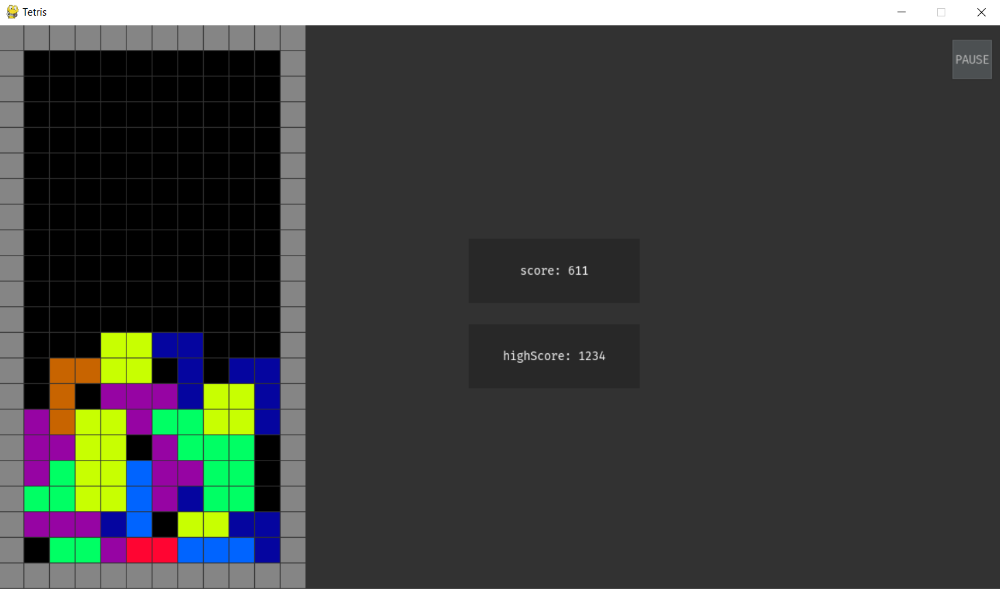
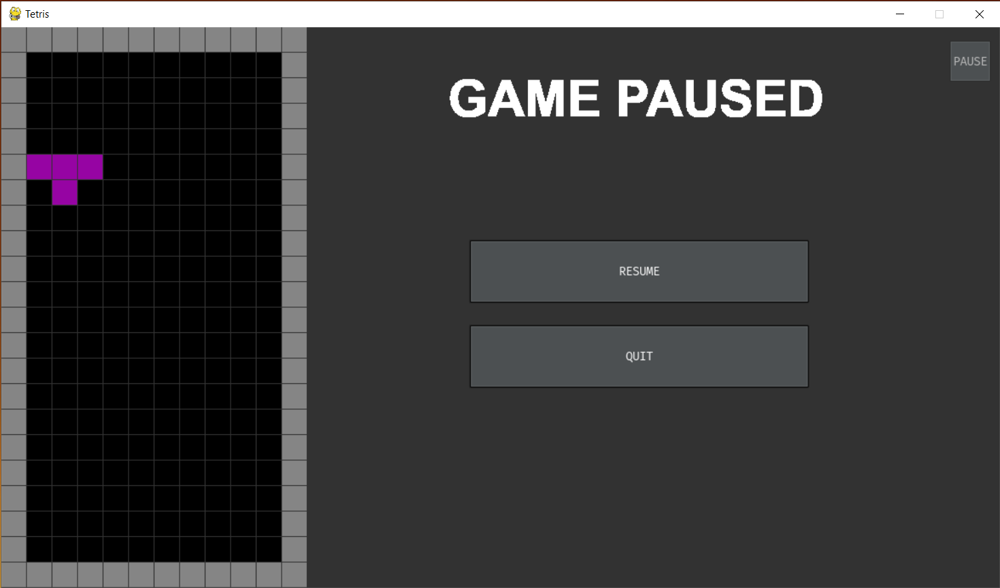
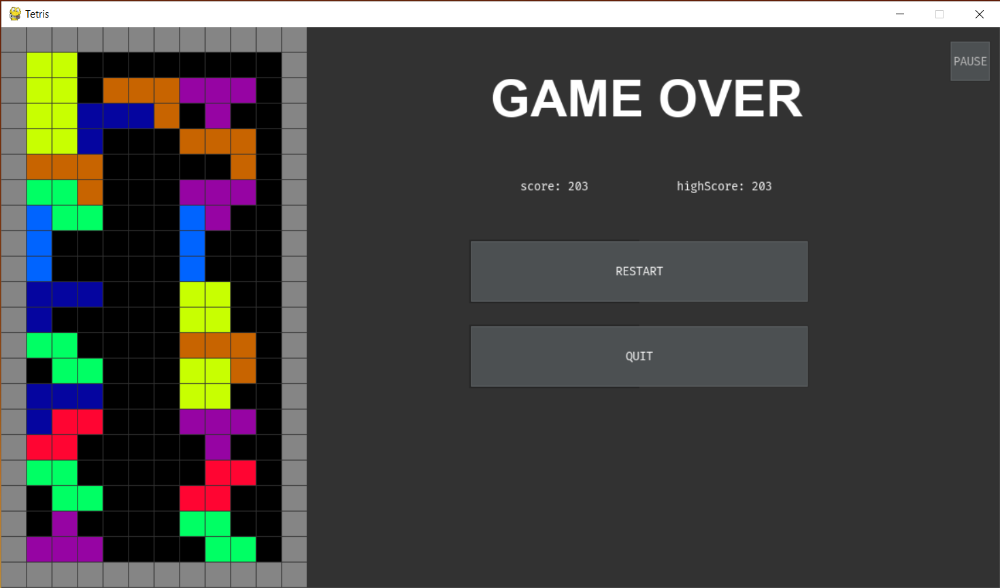

# 
Tetris

<h1 align="center" id="summary">
Summary
</h1>

* **[Summary](#summary)**
* **[Credits](#credits)**
* **[Features](#features)**
* **[Install](#Install)**
* **[Pre-requisites](#Prerequisites)**
* **[Releases](#releases)**
* **[Keys](#keys)**

<h1 align="center" id="credits"> Credits </h1>

* **[Facon Nicolas](https://github.com/FACON-Nicolas)** : creator of the project

<h1 align="center" id="features">Features</h1>

Game paused interface

 

 

Game over interface 

 

 

<h1 align="center" id="Install">Install</h1>

 To install the Tetris project, <a href="https://github.com/FACON-Nicolas/Tetris/releases/tag/v1">click here</a> The project is composed by 3 things: The game, a batch file that launchs game and an installer file that installs python and frameworks

<h1 align="center" id="Prerequisites">
Pre-requisites
</h1>

 A file nammed <code>Installer.bat</code> (launched automatically when you launch the game for the first time) was created for that and install everything (except windows)

+ possess Windows 10
+ get python 3.7
+ get the lastest version of pygame ( ``py -3.7 -m pip install pygame`` )
+ get the lastest version of pygame_gui ( ``py -3.7 -m pip install pygame_gui`` )

<h1 align="center" id="releases"> Releases </h1> 

 + **1.0.0** : 2021-12-11
 + **1.0.1** : march 2022 (soon)

<h1 align="center" id="keys"> Keys </h1>

<table align="center">
 <thead>
  <tr>
   <th><b>Keys</b></th>
   <th><b>Actions</b></th>
  </tr>
 </thead>
 <tbody>
  <tr>
   <td align="center">UP</td>
   <td align="center">rotate piece</td>
  </tr>
  <tr>
   <td align="center">UP</td>
   <td align="center">go down piece</td>
  </tr>
  <tr>
   <td align="center">RIGHT</td>
   <td align="center">move right piece</td>
  </tr>
  <tr>
   <td align="center">LEFT</td>
   <td align="center">move left piece</td>
  </tr>
  <tr>
   <td align="center">SPACE</td>
   <td align="center">place piece</td>
  </tr>
  <tr>
   <td align="center">ESCAPE</td>
   <td align="center">Pause / Resume</td>
  </tr>

